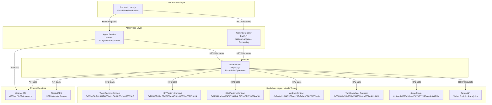
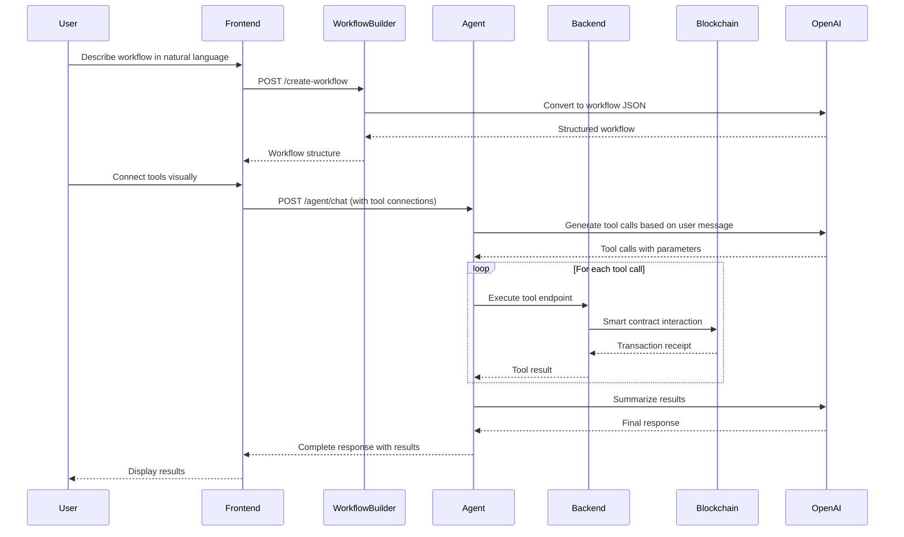
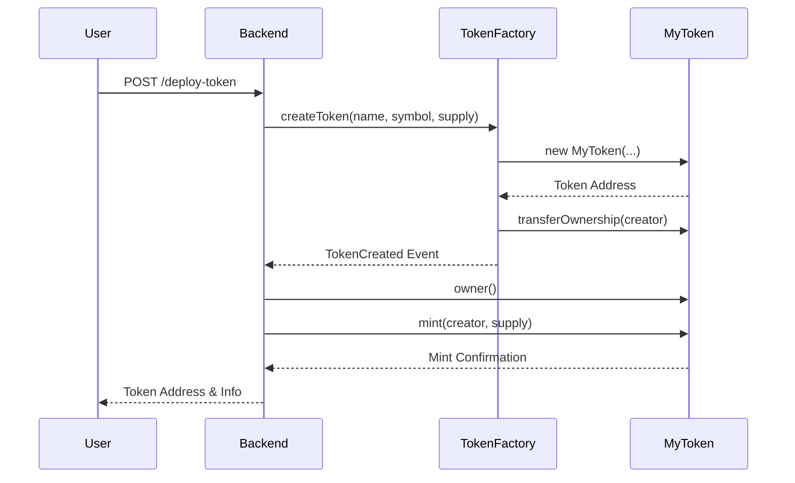
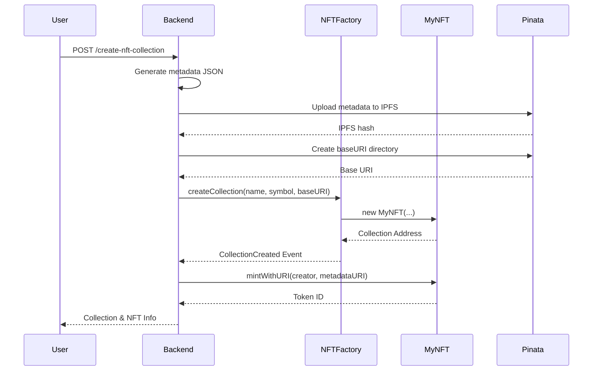
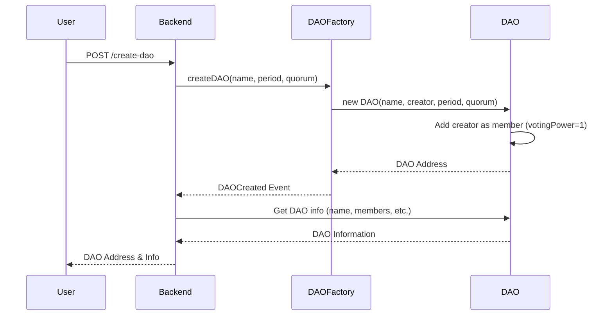
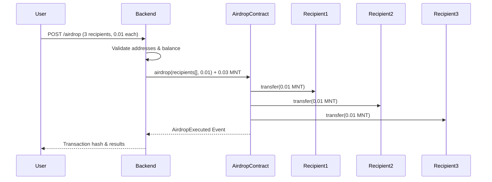
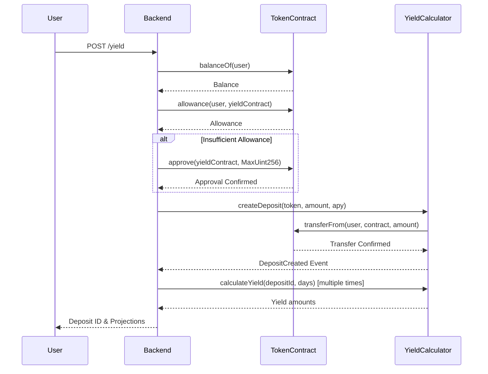
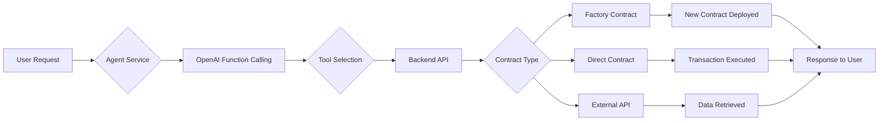
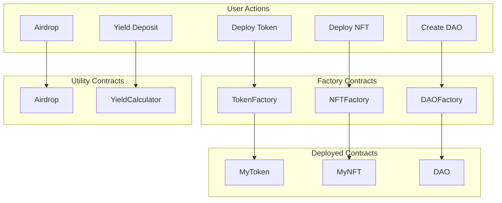

# Mantle No-Code Agent Builder

## Introduction

**Mantle No-Code Agent Builder** is a no-code platform that enables users to build, deploy, and interact with AI-powered blockchain agents on the Mantle testnet. The platform provides a visual workflow builder interface where users can create sophisticated blockchain automation workflows without writing code.

The platform supports 10 blockchain tools including **token transfers, swaps, token/NFT deployment, DAO creation, airdrops, yield calculations, price fetching, and wallet analytics**. All tools interact with smart contracts deployed on the Mantle testnet.

## Resources

* **Pitch Deck** : [View Here](https://www.canva.com/design/DAG-Mepf_e4/zYLX5h79SFjUJDy2uGc6kw/view?utm_content=DAG-Mepf_e4&utm_campaign=designshare&utm_medium=link2&utm_source=uniquelinks&utlId=hd03800f4ce)
* **Demo Video** : [View Here]()
* **Live Demo** : [View Here](https://Mantle-agent-builder.vercel.app)
  
### Deployed Tool Contracts

All smart contracts are deployed on the Mantle testnet. View them on the Explorer:

| Contract | Address | Explorer Link | Contract Code |
|----------|---------|---------------|---------------|
| **TokenFactory** | `0x1E491de1a08843079AAb4cFA516C717597344e50` | [View on Explorer](https://sepolia.mantlescan.xyz/address/0x1E491de1a08843079AAb4cFA516C717597344e50) | [TokenFactory.sol](https://github.com/SamFelix03/Mantle-No-Code-Agent-Builder/blob/main/backend/ERC-20/TokenFactory.sol) |
| **NFTFactory** | `0x0866f40d55e96b2d74995203caff032ad81c14b0` | [View on Explorer](https://sepolia.mantlescan.xyz/address/0x0866f40d55e96b2d74995203caff032ad81c14b0) | [NFTFactory.sol](https://github.com/SamFelix03/Mantle-No-Code-Agent-Builder/blob/main/backend/ERC-721/NFTFactory.sol) |
| **DAOFactory** | `0x3ea6d1c84481f89aac255a7abc375fe761653cda` | [View on Explorer](https://sepolia.mantlescan.xyz/address/0x3ea6d1c84481f89aac255a7abc375fe761653cda) | [DAO.sol](https://github.com/SamFelix03/Mantle-No-Code-Agent-Builder/blob/main/backend/DAO/DAO.sol) |
| **Airdrop** | `0x700D3D55ec6FC21394A43b02496F320E02873114` | [View on Explorer](https://sepolia.mantlescan.xyz/address/0x700D3D55ec6FC21394A43b02496F320E02873114) | [Airdrop.sol](https://github.com/SamFelix03/Mantle-No-Code-Agent-Builder/blob/main/backend/Air%20Drop/Airdrop.sol) |
| **YieldCalculator** | `0x6034FAcE419117Af850411CA58d83c1405F3398F` | [View on Explorer](https://sepolia.mantlescan.xyz/address/0x6034FAcE419117Af850411CA58d83c1405F3398F) | [YieldCalculator.sol](https://github.com/SamFelix03/Mantle-No-Code-Agent-Builder/blob/main/backend/Yield/YieldCalculator.sol) |

---

## How to Use

Getting started with Mantle No-Code Agent Builder is simple! Follow these steps:

1. **Visit** [https://Mantle-agent-builder.vercel.app](https://Mantle-agent-builder.vercel.app)
2. **Get Started** with just a Google sign in.
3. **Create an Agent Wallet** or Import your own wallet from private key.
   
   

4. **Create Your First Agent** by just drag-dropping the tools you need!
   
   

5. **You Can Also AI Generate Your Agent!** just ask our AI to generate your agent with the right tools.
   
   

6. **Save your agent**.

   

7. **Interact with it** in the UI or with curl requests by using your api key.
   
   

   

That's it! You've created your first Mantle agent without any programming knowledge, as simple as that!

---

## Table of Contents

1. [Platform Architecture](#platform-architecture)
2. [System Components](#system-components)
   - [Frontend](#frontend)
   - [Backend API](#backend-api)
   - [Agent Service](#agent-service)
   - [Workflow Builder](#workflow-builder)
3. [Blockchain Tools](#blockchain-tools)
   - [Transfer Tool](#1-transfer-tool)
   - [Swap Tool](#2-swap-tool)
   - [Balance Fetch Tool](#3-balance-fetch-tool)
   - [ERC-20 Token Deployment](#4-erc-20-token-deployment)
   - [ERC-721 NFT Collection Deployment](#5-erc-721-nft-collection-deployment)
   - [DAO Creation](#6-dao-creation)
   - [Airdrop Tool](#7-airdrop-tool)
   - [Token Price Fetching](#8-token-price-fetching)
   - [Yield Calculator](#9-yield-calculator)
   - [Wallet Analytics](#10-wallet-analytics)
4. [Smart Contract Implementations](#smart-contract-implementations)
   - [TokenFactory & MyToken](#tokenfactory--mytoken)
   - [NFTFactory & MyNFT](#nftfactory--mynft)
   - [DAOFactory & DAO](#daofactory--dao)
   - [Airdrop Contract](#airdrop-contract)
   - [YieldCalculator Contract](#yieldcalculator-contract)

---

## Platform Architecture

### High-Level Architecture Diagram



### Data Flow Diagram



---

## System Components

### Frontend

**Technology Stack:**
- Next.js 15 (React 19)
- TypeScript
- React Flow (visual workflow builder)
- Tailwind CSS
- Radix UI components

**Key Features:**
- Visual drag-and-drop workflow builder
- Node-based tool configuration
- Real-time AI chat interface
- Workflow saving and loading
- Agent management dashboard

**Main Components:**
- `workflow-builder.tsx` - Main workflow canvas with React Flow
- `node-library.tsx` - Tool palette for dragging tools onto canvas
- `node-config-panel.tsx` - Configuration panel for selected nodes
- `ai-chat-modal.tsx` - Chat interface for interacting with agents
- Custom node types: Input, Output, Process, Conditional, Code

### Backend API

**Technology Stack:**
- Express.js
- ethers.js v6
- Solidity compiler (solc)
- Axios for HTTP requests
- OpenAI SDK

**Network:**
- Mantle Testnet RPC: `https://rpc.sepolia.mantle.xyz`
- Explorer: `https://sepolia.mantlescan.xyz`

**Key Responsibilities:**
- Blockchain interaction via ethers.js
- Smart contract deployment and interaction
- Token/NFT/DAO creation via factory contracts
- IPFS metadata upload for NFTs
- Token price fetching via OpenAI search
- Wallet portfolio and analytics via Zerion API

**Port:** 3000 (default)

### Agent Service

**Technology Stack:**
- FastAPI
- OpenAI GPT-4o
- Python requests library

**Key Features:**
- Dynamic tool configuration based on workflow
- Sequential tool execution support
- Function calling with OpenAI
- Context-aware tool selection
- Private key management for transactions

**Endpoints:**
- `POST /agent/chat` - Main chat endpoint with tool execution
- `GET /tools` - List all available tools
- `GET /health` - Health check

**Port:** 8000 (default)

### Workflow Builder

**Technology Stack:**
- FastAPI
- OpenAI GPT-4o-2024-08-06 (structured outputs)

**Key Features:**
- Natural language to workflow conversion
- Structured JSON output with tool connections
- Sequential execution detection
- Tool type validation

**Endpoints:**
- `POST /create-workflow` - Convert natural language to workflow
- `GET /available-tools` - List available tools
- `GET /health` - Health check

**Port:** 8000 (default, different from agent service in production)

---

## Blockchain Tools

### 1. Transfer Tool

**Endpoint:** `POST /transfer`

**Description:**
Transfers native MNT tokens or ERC-20 tokens from one wallet to another. Supports both native token transfers and ERC-20 token transfers.

**Request Body:**
```json
{
  "privateKey": "0x...",
  "toAddress": "0x...",
  "amount": "0.01",
  "tokenAddress": "0x..." // Optional: if provided, transfers ERC-20 tokens
}
```

**Implementation Details:**

**For Native Token Transfer:**
1. Validates wallet balance
2. Creates transaction with `ethers.parseEther(amount)`
3. Sends transaction via `wallet.sendTransaction()`
4. Waits for confirmation
5. Returns transaction hash and explorer link

**For ERC-20 Token Transfer:**
1. Connects to token contract using ERC-20 ABI
2. Fetches token decimals
3. Parses amount with proper decimals: `ethers.parseUnits(amount, decimals)`
4. Checks token balance using `balanceOf()`
5. Calls `transfer()` function on token contract
6. Waits for transaction confirmation
7. Returns token info, transaction hash, and explorer link

**Response:**
```json
{
  "success": true,
  "type": "native" | "ERC20",
  "transactionHash": "0x...",
  "from": "0x...",
  "to": "0x...",
  "amount": "0.01",
  "blockNumber": 217915266,
  "gasUsed": "421000",
  "explorerUrl": "https://sepolia.mantlescan.xyz/tx/..."
}
```

**Contract Interaction:**
- Uses standard ERC-20 interface: `transfer(address to, uint256 amount)`
- No smart contract deployment needed (uses existing token contracts)

**Example:**
- [Transfer transaction](https://sepolia.mantlescan.xyz/tx/0x0af995d10c82abe5a56f7356d51970fc576fa8a50825348357336f31527251a6)

---

### 2. Swap Tool

**Endpoint:** `POST /swap`

**Description:**
Swaps one ERC-20 token for another using Uniswap V2/V3 compatible router on Mantle testnet.

**Request Body:**
```json
{
  "privateKey": "0x...",
  "tokenIn": "0x...",
  "tokenOut": "0x...",
  "amountIn": "10",
  "slippageTolerance": 3,
  "poolFee": 500,
  "routerType": "uniswap_v3"
}
```

**Implementation Details:**

1. **Token Approval:**
   - Checks current allowance
   - If insufficient, calls `approve()` on tokenIn contract
   - Approves swap router address: `0x6aac14f090a35eea150705f72d90e4cdc4a49b2c`

2. **Amount Calculation:**
   - Parses input amount with token decimals
   - Calculates minimum output: `amountIn * (100 - slippageTolerance) / 100`
   - Parses output amount with output token decimals

3. **Swap Execution:**
   - **Uniswap V3:** Uses `exactInputSingle()` with pool fee
   - **Uniswap V2:** Uses `swapExactTokensForTokens()` with deadline
   - Estimates gas and adds 50% buffer
   - Executes swap transaction

4. **Transaction Confirmation:**
   - Waits for transaction receipt
   - Returns approval and swap transaction hashes

**Response:**
```json
{
  "success": true,
  "wallet": "0x...",
  "tokenIn": "0x...",
  "tokenOut": "0x...",
  "amountIn": "10",
  "slippageTolerance": 3,
  "routerType": "uniswap_v3",
  "approveTxHash": "0x...",
  "swapTxHash": "0x...",
  "blockNumber": 218000000,
  "gasUsed": "150000",
  "explorerUrl": "https://sepolia.mantlescan.xyz/tx/..."
}
```

**Contract Interaction:**
- **Swap Router:** `0x6aac14f090a35eea150705f72d90e4cdc4a49b2c`
- **Uniswap V3 Router ABI:** `exactInputSingle((address,address,uint24,address,uint256,uint256,uint160))`
- **Uniswap V2 Router ABI:** `swapExactTokensForTokens(uint256,uint256,address[],address,uint256)`

---

### 3. Balance Fetch Tool

**Endpoint:** `GET /balance/:address` or `GET /balance/:address/:token`

**Description:**
Fetches native MNT balance or ERC-20 token balance for a wallet address.

**Implementation Details:**

**Native Balance:**
1. Uses `provider.getBalance(address)`
2. Formats using `ethers.formatEther()`
3. Returns balance in MNT and wei

**ERC-20 Balance:**
1. Connects to token contract
2. Calls `balanceOf(address)`
3. Fetches `decimals()`, `symbol()`, `name()`
4. Formats balance using `ethers.formatUnits(balance, decimals)`
5. Returns token info and balance

**Response:**
```json
{
  "address": "0x...",
  "token": "0x...",
  "name": "Token Name",
  "symbol": "TKN",
  "balance": "1000.0",
  "balanceWei": "1000000000000000000000",
  "decimals": 18
}
```

**Contract Interaction:**
- Standard ERC-20 interface: `balanceOf(address)`, `decimals()`, `symbol()`, `name()`

---

### 4. ERC-20 Token Deployment

**Endpoint:** `POST /deploy-token`

**Description:**
Deploys a new ERC-20 token using the TokenFactory contract. Creates a customizable token with minting, burning, and pause capabilities.

**Request Body:**
```json
{
  "privateKey": "0x...",
  "name": "SuperCoin",
  "symbol": "SUC",
  "initialSupply": "100000"
}
```

**Implementation Details:**

1. **Factory Contract Interaction:**
   - Factory Address: `0x6034FAcE419117Af850411CA58d83c1405F3398F`
   - Calls `createToken(name, symbol, initialSupply)`
   - Estimates gas and adds 20% buffer
   - Sends transaction

2. **Event Parsing:**
   - Parses `TokenCreated` event from transaction receipt
   - Extracts new token address from event

3. **Token Transfer:**
   - Checks if creator is token owner
   - If owner, mints tokens to creator using `mint()` function
   - This increases total supply but ensures creator has tokens

4. **Token Info Retrieval:**
   - Calls factory `getTokenInfo(tokenAddress)`
   - Returns token metadata, creator, owner, supply info

**Response:**
```json
{
  "success": true,
  "message": "Token created successfully via TokenFactory",
  "contractAddress": "0x...",
  "tokenInfo": {
    "name": "SuperCoin",
    "symbol": "SUC",
    "initialSupply": "100000",
    "currentSupply": "200000.0",
    "creator": "0x...",
    "owner": "0x...",
    "deployedAt": "2025-11-04T09:53:46.000Z"
  },
  "transactionHash": "0x...",
  "explorerUrl": "https://sepolia.mantlescan.xyz/tx/..."
}
```

**Contract Interaction Diagram:**



**Example:**
- [Deployed ERC-20 Test Token](https://sepolia.mantlescan.xyz/token/0x93c343D5C94Eac8089F1963fA75b874Db2C9f6FB)

---

### 5. ERC-721 NFT Collection Deployment

**Endpoint:** `POST /create-nft-collection`

**Description:**
Creates a new ERC-721 NFT collection with automatic IPFS metadata upload and mints the first NFT.

**Request Body:**
```json
{
  "privateKey": "0x...",
  "name": "Bat Collection",
  "symbol": "BAC"
}
```

**Implementation Details:**

1. **Metadata Generation:**
   - Creates JSON metadata for first NFT
   - Includes name, description, image, attributes
   - Uses placeholder image initially

2. **IPFS Upload:**
   - Uploads metadata to Pinata IPFS
   - Requires `PINATA_API_KEY` and `PINATA_SECRET_KEY`
   - Returns IPFS hash: `ipfs://QmXxx...`

3. **Base URI Creation:**
   - Creates IPFS directory structure
   - Uploads base directory metadata
   - Returns baseURI: `ipfs://QmXxx/`

4. **Collection Creation:**
   - Factory Address: `0x700D3D55ec6FC21394A43b02496F320E02873114`
   - Calls `createCollection(name, symbol, baseURI)`
   - Parses `CollectionCreated` event

5. **First NFT Minting:**
   - Connects to NFT collection contract
   - Calls `mintWithURI(creator, metadataURI)`
   - Returns token ID and metadata info

**Response:**
```json
{
  "success": true,
  "message": "NFT collection created and first NFT minted successfully",
  "collection": {
    "address": "0x...",
    "name": "Bat Collection",
    "symbol": "BAC",
    "baseURI": "ipfs://QmXxx/"
  },
  "firstNFT": {
    "tokenId": "1",
    "owner": "0x...",
    "metadataURI": "ipfs://QmXxx...",
    "metadata": {...}
  },
  "transactions": {
    "collectionCreation": "0x...",
    "minting": "0x..."
  }
}
```

**Contract Interaction Diagram:**



**Example:**
- [NFT Collection](https://sepolia.mantlescan.xyz/token/0x2Feaba0eD96df2190dF47b2427C880FF8056AB2a)

---

### 6. DAO Creation

**Endpoint:** `POST /create-dao`

**Description:**
Creates a new Decentralized Autonomous Organization (DAO) with customizable voting period and quorum percentage.

**Request Body:**
```json
{
  "privateKey": "0x...",
  "name": "My COOL DAO",
  "votingPeriod": "604800",
  "quorumPercentage": "51"
}
```

**Implementation Details:**

1. **Validation:**
   - Validates voting period > 0 (in seconds)
   - Validates quorum percentage (0-100)

2. **DAO Creation:**
   - Factory Address: `0x1E491de1a08843079AAb4cFA516C717597344e50`
   - Calls `createDAO(name, votingPeriod, quorumPercentage)`
   - Factory deploys new DAO contract
   - Creator is automatically added as first member with voting power 1

3. **DAO Info Retrieval:**
   - Connects to created DAO contract
   - Fetches: name, owner, memberCount, votingPeriod, quorumPercentage, proposalCount, totalVotingPower

**Response:**
```json
{
  "success": true,
  "message": "DAO created successfully via DAOFactory",
  "dao": {
    "address": "0x...",
    "name": "My COOL DAO",
    "owner": "0x...",
    "memberCount": "1",
    "votingPeriod": {
      "seconds": "604800",
      "days": "7.00"
    },
    "quorumPercentage": "51",
    "proposalCount": "0",
    "totalVotingPower": "1"
  },
  "transactionHash": "0x...",
  "explorerUrl": "https://sepolia.mantlescan.xyz/tx/..."
}
```

**Contract Interaction Diagram:**



**Example:**
- [Created DAO with members and votes](https://sepolia.mantlescan.xyz/address/0x473CA2787ef8d3d57BB6930D3F6f2Ab91CCA2954?tab=index)

---

### 7. Airdrop Tool

**Endpoint:** `POST /airdrop`

**Description:**
Batch transfers native MNT tokens to multiple addresses in a single transaction using the Airdrop contract.

**Request Body:**
```json
{
  "privateKey": "0x...",
  "recipients": ["0x...", "0x...", "0x..."],
  "amount": "0.01"
}
```

**Implementation Details:**

1. **Validation:**
   - Validates recipients array is non-empty
   - Validates all addresses are valid Ethereum addresses
   - Validates amount > 0

2. **Balance Check:**
   - Calculates total amount: `amount * recipients.length`
   - Checks wallet balance >= total amount

3. **Airdrop Execution:**
   - Contract Address: `0x3ea6d1c84481f89aac255a7abc375fe761653cda`
   - Calls `airdrop(recipients, amountPerRecipient)`
   - Sends total amount as `msg.value`
   - Contract distributes tokens to all recipients

4. **Event Parsing:**
   - Parses `AirdropExecuted` event
   - Extracts executor, recipients, total amount, timestamp

**Response:**
```json
{
  "success": true,
  "message": "Airdrop executed successfully",
  "airdrop": {
    "from": "0x...",
    "recipientsCount": 3,
    "recipients": ["0x...", "0x...", "0x..."],
    "amountPerRecipient": "0.01",
    "totalAmount": "0.03"
  },
  "transaction": {
    "hash": "0x...",
    "blockNumber": 218174401,
    "gasUsed": "133488"
  },
  "event": {
    "executor": "0x...",
    "totalAmount": "30000000000000000",
    "timestamp": "2025-11-02T11:31:42.000Z"
  }
}
```

**Contract Interaction Diagram:**



**Example:**
- [Airdrop transaction to 3 addresses](https://sepolia.mantlescan.xyz/tx/0x9a1e13e1b57df033f5cc1c5b99e18dd70d0e7287ca816c5d8b6ad9aeecddb2cf)

---

### 8. Token Price Fetching

**Endpoint:** `POST /token-price`

**Description:**
Fetches current cryptocurrency prices with natural language queries.

**Request Body:**
```json
{
  "query": "bitcoin current price"
}
```

**Implementation Details:**

1. **Query Processing:**
   - System prompt instructs model to:
     - Parse natural language queries
     - Identify cryptocurrency symbols
     - Search for current prices
     - Return structured price information

**Response:**
```json
{
  "success": true,
  "query": "bitcoin current price",
  "response": "As of November 2, 2025, Bitcoin (BTC) is trading at approximately $110,957 USD...",
  "timestamp": "2025-11-02T12:24:30.862Z",
}
```

---

### 9. Yield Calculator

**Endpoint:** `POST /yield`

**Description:**
Creates a deposit with yield prediction using any ERC-20 token. Calculates yield based on APY and time period.

**Request Body:**
```json
{
  "privateKey": "0x...",
  "tokenAddress": "0x...",
  "depositAmount": "0.1",
  "apyPercent": 5
}
```

**Implementation Details:**

1. **Token Approval:**
   - Checks token balance
   - Checks allowance for YieldCalculator contract
   - Approves if needed: `approve(contractAddress, MaxUint256)`

2. **Deposit Creation:**
   - Contract Address: `0x0866f40d55e96b2d74995203caff032ad81c14b0` (or from `YIELD_CALCULATOR_ADDRESS` env var)
   - Calls `createDeposit(tokenAddress, amount, apy)`
   - APY converted to basis points: `apyPercent * 100`
   - Tokens transferred from user to contract

3. **Yield Projections:**
   - Calculates yield for multiple periods: 7, 30, 60, 90, 180, 365 days
   - Uses formula: `amount * (apy / 10000) * (timeInSeconds / 31536000)`
   - Returns projections with total value (principal + yield)

**Response:**
```json
{
  "success": true,
  "message": "Deposit created successfully",
  "deposit": {
    "depositId": "2",
    "tokenAddress": "0x...",
    "tokenName": "SuperCoin",
    "tokenSymbol": "SUC",
    "depositAmount": "0.1",
    "apyPercent": 5,
    "principal": "0.1",
    "currentYield": "0.000000000158548959",
    "totalAmount": "0.100000000158548959",
    "daysPassed": "0.00",
    "active": true
  },
  "projections": [
    {
      "days": 7,
      "yieldAmount": "0.000095890410958904",
      "principal": "0.1",
      "totalValue": "0.100096",
      "tokenSymbol": "SUC"
    },
    ...
  ]
}
```

**Contract Interaction Diagram:**



**Example:**
- [Yield deposit transaction](https://sepolia.mantlescan.xyz/tx/0xc742a02bc4765cf23fdab134c2b3a59bdd2b2f310c994c73aaab5080429c7ea0)

---

### 10. Wallet Analytics

**Endpoint:** `POST /api/balance/erc20`

**Description:**
Fetches wallet portfolio including native MNT balance and all ERC-20 token balances for a wallet address using Zerion API. Provides comprehensive wallet analytics with token prices and USD values.

**Request Body:**
```json
{
  "address": "0x..."
}
```

**Implementation Details:**

1. **Address Validation:**
   - Validates Ethereum address format using `ethers.isAddress()`
   - Returns error if address is invalid

2. **Zerion API Request:**
   - Endpoint: `https://api.zerion.io/v1/wallets/{address}/portfolio?filter[positions]=only_simple&currency=usd&sync=false`
   - Authorization: Uses `ZERION_API_AUTH` environment variable (defaults to basic auth if not set)
   - Timeout: 30 seconds
   - Headers: `Accept: application/json`, `Authorization: {zerionAuth}`

3. **Native Balance Fetching:**
   - Fetches native MNT balance directly from blockchain using `provider.getBalance()`
   - Formats balance using `ethers.formatEther()`

4. **Response Processing:**
   - Parses Zerion portfolio data to extract token positions
   - Filters out zero balances
   - Extracts token metadata: contract address, name, symbol, decimals, price (USD), value (USD)
   - Calculates total portfolio value in USD
   - Formats balances in both human-readable and wei formats

**Response:**
```json
{
  "success": true,
  "address": "0x...",
  "nativeBalance": {
    "balance": "1.5",
    "balanceWei": "1500000000000000000",
    "symbol": "MNT",
    "name": "Mantle"
  },
  "tokenBalances": [
    {
      "contractAddress": "0x...",
      "name": "Token Name",
      "symbol": "TKN",
      "balance": "1000.0",
      "balanceWei": "1000000000000000000000",
      "decimals": 18,
      "priceUsd": 0.5,
      "valueUsd": 500.0
    }
  ],
  "totalTokens": 1,
  "totalValueUsd": 500.0,
  "timestamp": "2025-11-02T12:00:00.000Z",
  "rawData": { ... }
}
```

**Environment Variables:**
- `ZERION_API_AUTH` (optional): Zerion API authorization header. If not set, uses a default basic auth token.

**Error Handling:**
- Returns 400 if address is missing or invalid
- Returns 400 if Zerion API returns errors
- Returns 500 if Zerion API is unreachable or request fails
- Includes detailed error messages and API response data in error responses

---

## Smart Contract Implementations

### TokenFactory & MyToken

**Location:** [`backend/ERC-20/`](https://github.com/SamFelix03/Mantle-No-Code-Agent-Builder/tree/main/backend/ERC-20)

#### TokenFactory Contract

**Address:** `0x6034FAcE419117Af850411CA58d83c1405F3398F`

**Key Functions:**
- `createToken(string name, string symbol, uint256 initialSupply)` - Deploys new MyToken contract
- `getTotalTokensDeployed()` - Returns total count
- `getTokensByCreator(address creator)` - Returns tokens created by address
- `getTokenInfo(address tokenAddress)` - Returns detailed token information

**Storage:**
- `deployedTokens[]` - Array of all deployed token addresses
- `creatorToTokens` - Mapping from creator to their tokens
- `tokenInfo` - Mapping from token address to TokenInfo struct

**Events:**
- `TokenCreated(address indexed tokenAddress, address indexed creator, string name, string symbol, uint256 initialSupply, uint256 timestamp)`

#### MyToken Contract

**Features:**
- ERC-20 standard implementation
- ERC20Burnable (tokens can be burned)
- ERC20Permit (gasless approvals)
- Ownable (owner-only functions)
- Pausable transfers (owner can pause)

**Key Functions:**
- `mint(address to, uint256 amount)` - Owner can mint new tokens
- `burn(uint256 amount)` - Anyone can burn their tokens
- `pause()` / `unpause()` - Owner can pause transfers
- `transfer()` / `transferFrom()` - Standard ERC-20 transfers (respects pause)

**Constructor:**
- Mints initial supply to deployer
- Sets deployer as owner
- Sets pause state to false

---

### NFTFactory & MyNFT

**Location:** [`backend/ERC-721/`](https://github.com/SamFelix03/Mantle-No-Code-Agent-Builder/tree/main/backend/ERC-721)

#### NFTFactory Contract

**Address:** `0x700D3D55ec6FC21394A43b02496F320E02873114`

**Key Functions:**
- `createCollection(string name, string symbol, string baseURI)` - Deploys new MyNFT collection
- `getCollectionsByCreator(address creator)` - Returns collections by creator
- `getCollectionInfo(address collectionAddress)` - Returns collection details
- `getCollectionStats(address collectionAddress)` - Returns minting statistics

**Storage:**
- `deployedCollections[]` - Array of all collection addresses
- `creatorToCollections` - Mapping from creator to collections
- `collectionInfo` - Mapping from collection to CollectionInfo struct

**Events:**
- `CollectionCreated(address indexed collectionAddress, address indexed creator, string name, string symbol, string baseURI, uint256 timestamp)`

#### MyNFT Contract

**Features:**
- ERC-721 standard implementation
- ERC721URIStorage (custom token URIs)
- ERC721Burnable (tokens can be burned)
- Ownable (owner-only minting)
- Pausable transfers

**Key Functions:**
- `mint(address to)` - Owner mints NFT with baseURI + tokenId
- `mintWithURI(address to, string uri)` - Owner mints with custom URI
- `mintBatch(address to, uint256 amount)` - Batch minting (max 100)
- `setBaseURI(string baseURI)` - Owner updates base URI
- `setTokenURI(uint256 tokenId, string uri)` - Owner sets custom URI
- `pause()` / `unpause()` - Owner pauses transfers
- `tokensOfOwner(address owner)` - Returns all token IDs owned by address

**Token ID System:**
- Starts from 1
- Auto-increments with each mint
- `totalMinted()` returns count of minted tokens

---

### DAOFactory & DAO

**Location:** [`backend/DAO/`](https://github.com/SamFelix03/Mantle-No-Code-Agent-Builder/tree/main/backend/DAO)

#### DAOFactory Contract

**Address:** `0x1E491de1a08843079AAb4cFA516C717597344e50`

**Key Functions:**
- `createDAO(string _name, uint256 _votingPeriod, uint256 _quorumPercentage)` - Deploys new DAO
- `getDAOCount()` - Returns total DAO count
- `getCreatorDAOs(address _creator)` - Returns DAOs created by address
- `getAllDAOs()` - Returns all DAO addresses

**Storage:**
- `allDAOs[]` - Array of all DAO addresses
- `creatorDAOs` - Mapping from creator to their DAOs

**Events:**
- `DAOCreated(address indexed daoAddress, string name, address indexed creator, uint256 votingPeriod, uint256 quorumPercentage, uint256 timestamp)`

#### DAO Contract

**Features:**
- Member management with voting power
- Proposal creation and voting
- Quorum-based execution
- Time-based voting periods

**Key Structures:**
```solidity
struct Member {
    bool isMember;
    uint256 votingPower;
    uint256 joinedAt;
}

struct Proposal {
    uint256 id;
    string description;
    address proposer;
    uint256 forVotes;
    uint256 againstVotes;
    uint256 startTime;
    uint256 endTime;
    bool executed;
    bool passed;
    mapping(address => bool) hasVoted;
}
```

**Key Functions:**
- `addMember(address _member, uint256 _votingPower)` - Only members can add members
- `removeMember(address _member)` - Remove member (not creator)
- `createProposal(string _description)` - Create new proposal
- `vote(uint256 _proposalId, bool _support)` - Vote on proposal
- `executeProposal(uint256 _proposalId)` - Execute proposal after voting period
- `getTotalVotingPower()` - Returns sum of all member voting powers

**Voting Logic:**
- Quorum: `(totalVotes * 100) >= (totalVotingPower * quorumPercentage)`
- Majority: `forVotes > againstVotes`
- Proposal passes if quorum met AND majority for

**Events:**
- `MemberAdded(address indexed member, uint256 votingPower)`
- `MemberRemoved(address indexed member)`
- `ProposalCreated(uint256 indexed proposalId, string description, address proposer)`
- `VoteCast(uint256 indexed proposalId, address indexed voter, bool support, uint256 weight)`
- `ProposalExecuted(uint256 indexed proposalId, bool passed)`

---

### Airdrop Contract

**Location:** [`backend/Air Drop/Airdrop.sol`](https://github.com/SamFelix03/Mantle-No-Code-Agent-Builder/blob/main/backend/Air%20Drop/Airdrop.sol)

**Address:** `0x3ea6d1c84481f89aac255a7abc375fe761653cda`

**Features:**
- Gas-efficient batch transfers
- Native token (MNT) distribution
- No contract storage needed (direct transfers)

**Key Functions:**
- `airdrop(address[] recipients, uint256 amount)` - Distribute same amount to all recipients
- `airdropWithAmounts(address[] recipients, uint256[] amounts)` - Distribute different amounts
- `getBalance()` - Returns contract balance (should be 0 after airdrop)
- `withdraw(address to)` - Owner emergency withdrawal

**Implementation:**
- Uses low-level `call{value: amount}("")` for gas efficiency
- Validates total amount matches `msg.value`
- Validates all recipients are non-zero addresses
- Emits `AirdropExecuted` event after completion

**Security:**
- Owner-only withdraw function
- Validates all inputs
- Reverts on transfer failures

---

### YieldCalculator Contract

**Location:** [`backend/Yield/YieldCalculator.sol`](https://github.com/SamFelix03/Mantle-No-Code-Agent-Builder/blob/main/backend/Yield/YieldCalculator.sol)

**Address:** `0x0866f40d55e96b2d74995203caff032ad81c14b0`

**Features:**
- Multi-token support (any ERC-20)
- APY-based yield calculation
- Time-based projections
- Deposit tracking per user

**Key Structures:**
```solidity
struct Deposit {
    address depositor;
    address tokenAddress;
    uint256 amount;
    uint256 apy; // Basis points (10000 = 100%)
    uint256 depositTime;
    bool active;
}
```

**Key Functions:**
- `createDeposit(address tokenAddress, uint256 amount, uint256 apy)` - Create new deposit
- `calculateYield(uint256 depositId, uint256 timeInSeconds)` - Calculate yield for time period
- `getCurrentYield(uint256 depositId)` - Get current accrued yield
- `getTotalAmount(uint256 depositId)` - Get principal + yield
- `withdraw(uint256 depositId)` - Withdraw deposit (principal + yield)
- `getUserDeposits(address user)` - Get all deposit IDs for user
- `getDepositInfo(uint256 depositId)` - Get deposit details

**Security:**
- Only depositor can withdraw their deposit
- Validates deposit is active
- Uses SafeERC20 for token transfers
- Checks contract balance before withdrawal

**Events:**
- `DepositCreated(address indexed depositor, uint256 depositId, address indexed tokenAddress, uint256 amount, uint256 apy)`
- `YieldCalculated(address indexed depositor, uint256 depositId, uint256 yieldAmount)`
- `Withdrawn(address indexed to, uint256 depositId, uint256 amount)`

---

## Architecture Diagrams

### Tool Execution Flow



### Contract Interaction Flow



---

## License

MIT License
